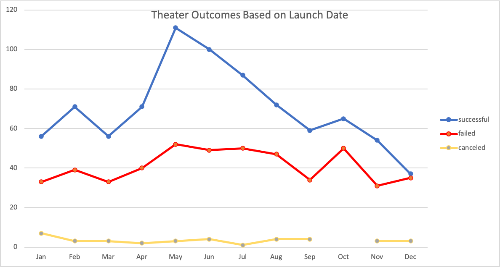
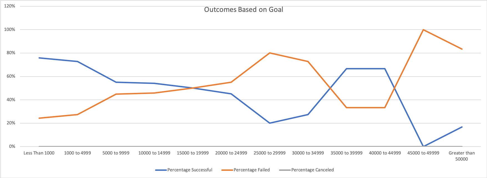

# Technical Analysis of Louise' Kickstarter Campaigns

## Overview of Project
This project provides a visual analysis and insight into Louise's crowdfunding dataset for "Theater" category. 

### Purpose
To organize, sort and analyze Louise's crowdfunding data and to determine how different campaigns fared in relation to their launch dates and their funding goals.

## Analysis and Challenges

### Analysis of Outcomes Based on Launch Date
Focusing on the "Theater_Outcomes_vs_Launch" line chart provided below, we can observe that the blue plot representing the number of successful outcomes starts increasing by the end of April and is peaking in the month of May.  From June onwards there is a steady decline in the number of successful outcomes. We also observe that the lowest point on the plot is in the month of December.

### Analysis of Outcomes Based on Goals
If we look at the blue plot representing the percentage of successful outcomes in the line chart of "Outcomes Based on Goals" below for "plays" sub-category, we can observe that the highest percentage of successful outcomes for this sub-category resulted when the goal was set to under $1000. We also observe that the campaign was a 100% failure for which the goals were set to $45000-$49999.

### Challenges and Difficulties Encountered
The line chart for "Outcomes Based on Goals" was not showing the expected plot. Upon further debugging, I realized that the criteria for "plays" sub-category was not mentioned in the COUNTIFS function. Upon providng appropriate criteria, the plot finally displayed as expected.

## Results

- What are two conclusions you can draw about the Outcomes based on Launch Date?
* The months of May and June have a higher success rate compared to the rest of the months. It seems to be a good time to launch campaigns.
* The month of Dec has the lowest number of successful campaigns and is not advisable to launch campaigns.

- What can you conclude about the Outcomes based on Goals?
Kickstarter campaigns with goals under $5000 have a higher success rate.

- What are some limitations of this dataset?
Source of backers is not known. 

- What are some other possible tables and/or graphs that we could create?
In order to give Louise a more detailed analysis on campaigns we could have created following charts/plots:
-- A bar chart of Parent category/sub category vs backers by source can give us the information about the sources of backers leading to successful outcomes.
-- An average number of days vs successful/failed & canceled bar chart would also give us an average number of days required per successful campaign.